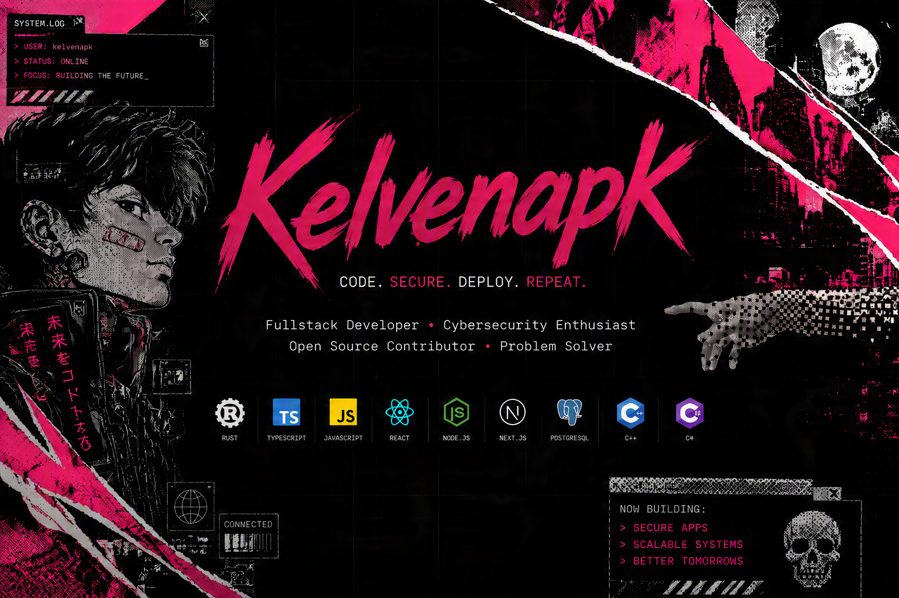
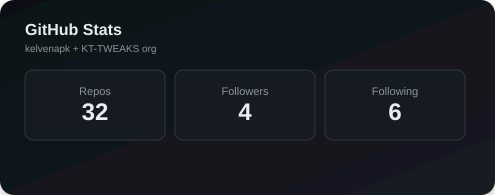
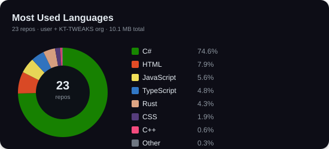

# Olá, eu sou **Kelven** — Criador da [KT TWEAKS](https://github.com/KT-TWEAKS)

**Desenvolvedor Full Stack · Arquiteto de Sistemas · Criador do KT Winzade**

Estudante de **Ciência da Computação** · 🇧🇷 Brasil

 

  

<!-- ===================== STACK ===================== -->

  

<!-- ===================== STATS ===================== -->

 

### 📊 GitHub Analytics

  

---

 

## 🚀 Projetos

<table>
<tr>
<td width="50%">

### KT TWEAKS — Site & Painel

</td>
<td width="50%">

### KT Wirzade Site

</td>
</tr>
<tr>
<td colspan="2">

### KT Winzade — Desktop App

</td>
</tr>
</table>

 

---

 

## 🌐 Vamos conversar

  

  

> *"Não existe otimização perfeita, só a próxima versão."*

 

  

